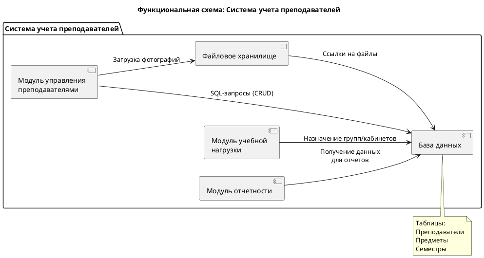
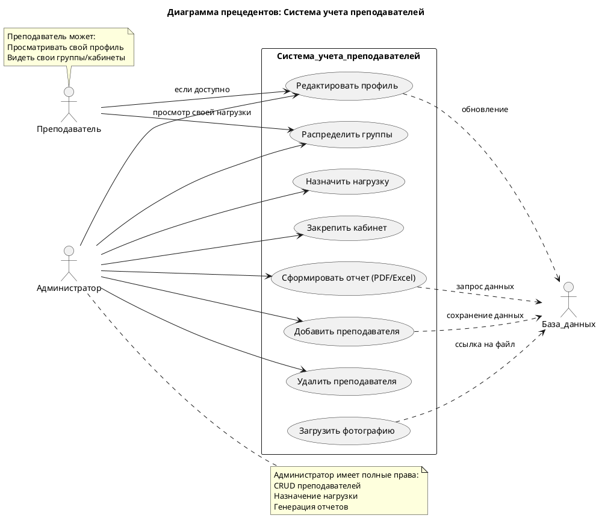
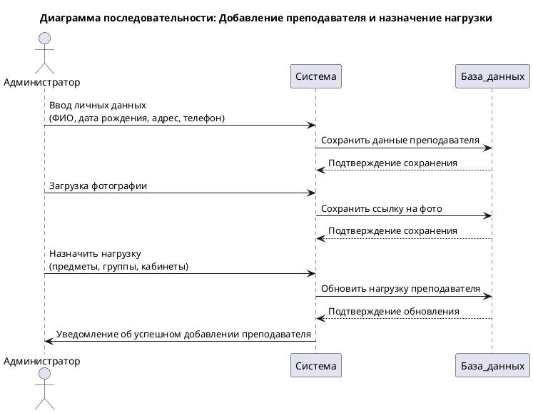
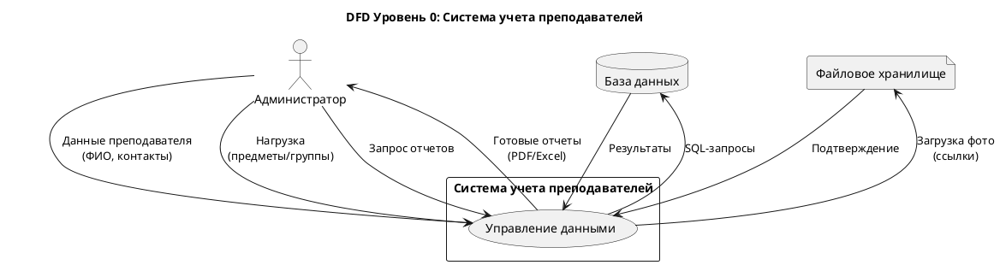
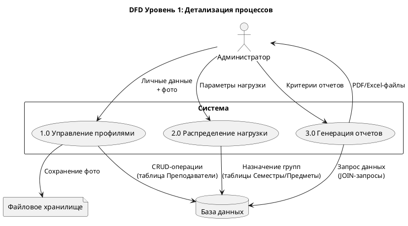
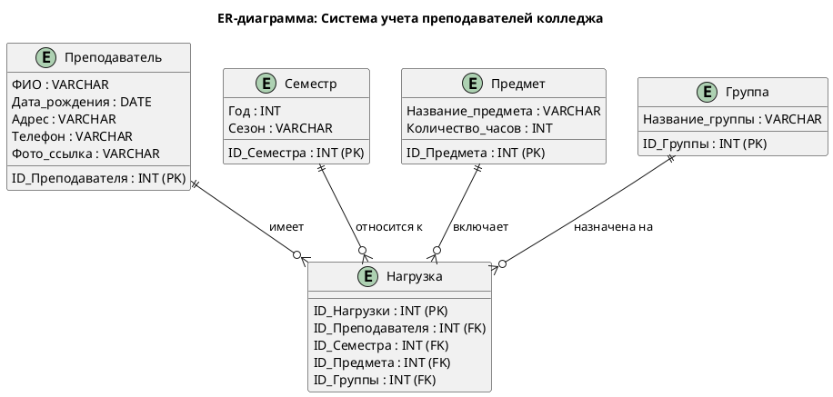

Вот отформатированный текст с сохранением оригинального содержания, но с улучшенной читаемостью:

---

#1. Требование – описание того, что система должна делать, какими свойствами обладать и каким ограничениям соответствовать.

## Классификация требований:
- **Функциональные** – что система должна делать (например, система должна позволять пользователям регистрироваться)
- **Нефункциональные** – как система должна это делать
- **Бизнес-требования** – высокоуровневые цели организации
- **Пользовательские требования** – что пользователи хотят получить от системы
- **Системные требования** – детальное описание функций системы

---

# 2.Уровни требований

Уровни требований – иерархия требований к проекту, включает три уровня:

## Верхний уровень: бизнес-требования
- Цели и задачи бизнеса, которые проект должен решить
- Описывает, почему проект создан и какие бизнес-выгоды от него ожидаются
- Пример: цель компании «увеличить продажи на 20%»

## Второй уровень: пользовательские требования
- Потребности пользователя, как система должна помочь в решении задач
- Пример: use-case «покупатель может оплатить заказ»

## Третий уровень: системные требования (функциональные)
- Детализированные требования, описывают как система должна функционировать
- Включают функциональные и нефункциональные требования
- Примеры: технические спецификации

---

#3. Методологии и стандарты работы с требованиями

## Методологии

Некоторые подходы к управлению требованиями:

### Agile
- Итеративный подход
- Подчёркивает адаптивность, непрерывную обратную связь и сотрудничество
- Требования постоянно уточняются, что позволяет командам быстро реагировать на изменения
- Подходит для проектов с меняющимися или неопределёнными требованиями

### Waterfall
- Линейный, последовательный подход
- Проходит через отдельные фазы: сбор требований, проектирование, внедрение, тестирование и развёртывание
- Каждая фаза должна быть завершена перед переходом к следующей
- Подходит для проектов с чётко определёнными требованиями с самого начала, например, в регулируемых отраслях, где обширная документация и стабильность имеют решающее значение

### Гибридный подход
- Сочетает элементы Agile и Waterfall
- Обеспечивает гибкость для команд, которым нужна структура в некоторых областях, но адаптивность в других
- Обычно подход Waterfall применяется на ранних этапах проекта, в то время как Agile используется во время разработки, тестирования и текущих циклов обратной связи

## Стандарты

Некоторые документы, регламентирующие работу с требованиями:
- **IEEE 1362** «Concept of Operations Document»
- **IEEE 1233** «Guide for Developing System Requirements Specifications» – разработки IEEE, которые описывают подходы к работе с требованиями
- **ГОСТ Р ИСО/МЭК 12207–2010** – стандарт, регламентирующий жизненный цикл программного обеспечения, включая процессы работы с требованиями
- **ГОСТ Р ИСО/МЭК 15288–2005** – стандарт, рассматривающий ключевые этапы жизненного цикла программного обеспечения, включая работу с требованиями

---

# 4. Современные принципы разработки ПО
- **Agile-манифест** (индивидуумы и взаимодействие над процессами и инструментами)
- **DevOps** - интеграция разработки и эксплуатации
- **Микросервисная архитектура**
- **CI/CD** (непрерывная интеграция и доставка)
- **Принцип KISS** (Keep It Simple, Stupid)
- **Принцип DRY** (Don't Repeat Yourself)

---

# Технология разработки программного обеспечения – комплекс мер по созданию программных продуктов.

## Некоторые современные принципы разработки ПО:

### Итерационная модель
- Позволяет вернуться на любой предыдущий этап разработки ПО для уточнения требований и исправления компонентов
- Важно вовремя остановиться, итерации не могут продолжаться бесконечно

### Спиральная модель
- Все этапы разработки последовательно повторяются по кругу до тех пор, пока текущая версия программы не станет полностью соответствовать требованиям

### Гибкие методологии (Agile)
- Олицетворяют современные подходы к разработке ПО, обычно используются в небольших командах разработчиков
- Среди них такие модели жизненного цикла программного продукта, как Scrum, DSDM, XP, FDD и другие

### Бережливая разработка ПО (Lean)
- Её цель – увеличение уровня эффективности создания продукта и повышение результативности всех рабочих процессов
- Разработка организуется таким образом, чтобы на реализацию проекта ушло меньше денег и времени

### Предусмотрение возможности безболезненных изменений
- Этот принцип отличает ПО от других видов промышленных продуктов, так как большинство случаев ПО разрабатывается недостаточно определены
- Они уточняются по мере продвижения разработки системы и ПО для нее

---

#5. Методы организации работы в команде
- **Scrum**: Итеративная разработка со спринтами
- **Kanban**: Визуализация workflow
- **Pair programming**: Два разработчика за одним компьютером
- **Code review**: Коллегиальная проверка кода
- **Ежедневные stand-up встречи**
- **Инструменты**: Jira, Trello, Asana

## Организационные модели:
1. **Равноправная основа** – есть команда высококвалифицированных специалистов, разбирающихся в нескольких областях разработки и способных выполнить широкий ряд функций. Проект разрабатывается ими на равноправной основе. Каждый специалист отвечает за определенный участок работы.
2. **Высококвалифицированный опытный руководитель** – команда программистов может быть набрана из разработчиков, которые компетентны только в определенных областях, и иметь высокопрофессионального руководителя, разбирающегося во всех областях, в некоторых более, в некоторых менее детально. Руководитель курирует проект в целом и ставит задачи каждому члену команды.
3. **Старшие и младшие разработчики** – команда может состоять из групп разработчиков. Более опытные разработчики (старшие) решают более сложные задачи и имеют целостное представление о проекте. Менее опытные (младшие) выполняют более простые задачи, помогая старшим, могут не иметь представления о проекте в целом, занимаясь только отдельными задачами.

---

# 6. Системы контроля версий – программное обеспечение для облегчения работы с изменяющейся информацией. Такие системы позволяют:
- хранить несколько версий одного и того же документа
- возвращаться к более ранним версиям
- определять, кто и когда сделал то или иное изменение

## Некоторые особенности систем контроля версий в контексте разработки программного обеспечения:
- **Отслеживание конфликтов**: Если два человека изменяют один и тот же файл, один из них может случайно отменить изменения, сделанные другим. Системы контроля версий отслеживают такие конфликты и предлагают средства их решения
- **Автоматическое объединение изменений**: Большинство систем может автоматически объединить изменения, сделанные разными разработчиками. Но обычно это возможно только для текстовых файлов и при условии, что изменялись разные части этого файла
- **Контроль прав доступа**: Системы контролируют права доступа пользователей, разрешая или запрещая чтение или изменение данных, в зависимости от того, кто запрашивает это действие

Системы контроля версий широко применяются при разработке программного обеспечения, для хранения исходных кодов разрабатываемой программы

## Типы СКВ
- **Распределенные СКВ** – наличие нескольких копий репозитория на разных серверах, где каждый разработчик имеет копию истории изменений (git)
- **Централизованные СКВ** – все версии файлы хранятся на одном сервере (subversion)
- **Локальные СКВ** – вся история хранится на компьютере в базе данных

## Инструменты для работы с СКВ
- **IDE** – интегрированные среды разработки с поддержкой IDE с поддержкой VSC (Visaul Studio, Intelij Idea)
- **Консольные клиенты** – программы, позволяющие работать с VCS из cmd (GitBush, Mercurial Workbench)
- **Веб-интерфейсы** – онлайн сервисы в браузере, подходят для небольших проектов (GitLab, GitHub)

---

# 7. Подходы к интегрированию модулей

Интеграция модулей — это объединение различных программных компонентов в единую функциональную систему, где каждый элемент выполняет свою роль, при этом сохраняя целостность всей архитектуры.

## Big Bang
- все модули интегрируются сразу

## Incremental
- постепенная интеграция:
  - **Снизу вверх** (от низкоуровневых модулей)
  - **Сверху вниз** (от высокоуровневых модулей)
  - **Сэндвич** (комбинация обоих подходов)

## Непрерывная интеграция (CI)
- Подходы к интегрированию программных модулей включают вертикальную и горизонтальную интеграцию, использование API и событий. Каждый подход имеет свои способности реализации и применим в зависимости от конкретных задач и требований проекта

### Вертикальная интеграция
- Модули объединяются в строгой иерархической последовательности – начиная с базовых функция, заканчивая высокоуровневыми приложениями
- Пример: сбор операционных систем в единое корпоративное хранилище для анализа, управления и получения консолидированной отчетности
- Особенности:
  - Постепенное тестирование, четкая структура
  - Низкая гибкости, трудности с масштабированием

### Горизонтальная интеграция
- Модули подключаются параллельно одного уровня, что обеспечивает большую гибкость системы
- Пример: автоматизация управления цепями поставок – различные приложения или компоненты обеспечивают полный цикл логистических операций
- Особенности:
  - Высокая гибкость, легкость масштабирования
  - Сложность управления зависимостями

### API (Application Programming Interface)
- позволяет различным программным приложениям взаимодействовать друг с другом, обмениваться данными и функциональностью
- Принцип: одна система отправляет запрос, другая понимает запрос и отвечает
- Пример:
  - Интеграция CRM с телефонией: при поступлении звонка в телефонии API отправляет в CRM информацию о звонящем, в ответ CRM формирует карточку лида и сохраняет запись разговора

### События
- Компоненты взаимодействуют посредством асинхронных сообщений о событиях
- Это позволяет разрабатывать, развёртывать и масштабировать модули независимо друг от друга
- Принцип: производители событий (компоненты, сервисы или устройства) отправляют события на центральную шину событий, а потребители подписываются на определённые типы событий и выполняют предопределённые действия, когда эти события происходят

---

# 8. Стандарты кодирования

Стандарты кодирования — это набор правил и соглашений, определяющих, как писать и оформлять программный код. Они регламентируют всё: от именования переменных до структуры файлов проекта

## Некоторые преимущества соблюдения стандартов кодирования:
- **Повышение эффективности разработки**: Упрощает поддержку и обслуживание кода благодаря единому стилю написания. Сокращает время на понимание кода новыми участниками проекта
- **Улучшение качества кода**: Снижает количество ошибок за счёт проверенных практик. Облегчает код-ревью благодаря унификации стиля

## Некоторые популярные стандарты кодирования для разных языков программирования:
- **В Python** используется PEP 8, который определяет правила отступов, именования и организации кода
- **В JavaScript** популярны Google JavaScript Style Guide и Airbnb JavaScript Guide
- **Для Java** применяется Google Java Style Guide, задающий чёткие правила форматирования
- **В C++** используется Google C++ Style Guide, регламентирующий структуру и оформление

Помимо общепринятых стандартов, каждая команда может создавать собственные правила программирования. Эти требования должны:
- не противоречить базовым стандартам языка
- учитывать специфику проекта
- быть задокументированы и доступны всем участникам
- регулярно обновляться при необходимости

---

# 9. Описание требований: унифицированный язык моделирования (UML)

UML (Unified Modeling Language) — язык графического описания, который используют для моделирования программных систем, бизнес-процессов и других систем. Его цель — графически описать любую модель, будь то архитектура программы, структура системы или абстрактный план достижения бизнес-целей

## Основные термины

Некоторые ключевые понятия UML:
- **Класс** — описание множества объектов с общими атрибутами, определяющими состояние, и операциями, определяющими поведение
- **Объект** — экземпляр класса, то есть его версия со всеми свойствами и методами
- **Интерфейс** — набор доступных операций для объекта
- **Компонент** — большая часть системы, например, файл или библиотека приложения
- **Узел** — большая часть системы, которая включает в себя разные компоненты
- **Взаимодействие** — стрелка, которая показывает, как один объект обращается к другому
- **Зависимость** — отражает ситуацию, когда изменение одного элемента влияет на другой
- **Состояние** — представляет состояние объекта в определённый момент времени
- **Пакет** — группирует несколько элементов диаграммы по определённому критерию
- **Заметка** — добавляет комментарий или дополнительную информацию к другим элементам

## Примеры использования:
- **Разработка программного обеспечения**: Диаграммы классов помогают определить, какие объекты будут в интернет-магазине (Пользователь, Товар, Заказ), и какие у них будут свойства и методы
- **Бизнес-анализ и моделирование процессов**: С помощью языка аналитики визуализируют, как устроены рабочие процессы, выявляют узкие места и предлагают улучшения
- **Проектирование баз данных**: Диаграммы классов и компонентов помогают формализовать структуру таблиц, связей и ключей, например, при создании модели данных для CRM-системы
- **Системная инженерия**: Для моделирования взаимодействия программных и аппаратных компонентов, особенно в сложных технических проектах

  ---
  

## 10. Диаграммы UML (Unified Modeling Language) — это наглядные схемы, с помощью которых описывают структуру, поведение и взаимодействие различных компонентов в рамках системы или проекта. UML не является языком программирования — это язык визуализации

### Что показывают диаграммы:
- **Кто взаимодействует с системой** (пользователи, внешние сервисы) (диаграммы прецедентов)
- **Какие объекты есть в системе и как они связаны** (классы, компоненты, модули) (диаграммы классов, компонентов)
- **Как протекают процессы и логика**: шаги, ветвления, условия (диаграммы активности, состояний)
- **Как объекты обмениваются сообщениями**: последовательность вызовов, порядок действий (диаграммы последовательности)

---

# 11. Описание и оформление требований (спецификация)

Спецификация требований программного обеспечения — структурированный набор требований/запросов к программному обеспечению и его внешним интерфейсам

## Спецификация требований: SRS (Software Requirements Specification)

### Структура:
- Введение
- Общее описание
- Функциональные требования
- Нефункциональные требования
- Интерфейсы
- Ограничения

### Язык:
- Четкий
- Однозначный
- Измеримый

---

# 12. Анализ требований и стратегии выбора решения

Анализ требований — процесс выявления, определения и документирования требований к системе, продукту или процессу. Стратегии выбора решения помогают оценить альтернативы, учесть риски и выбрать оптимальный вариант

## Процесс анализа требований

Анализ требований включает несколько этапов:
1. **Сбор информации**: Собираются данные о проекте, целях, существующих решениях
2. **Анализ**: Выявляются требования к продукту, определяются функции, запросы к интерфейсу и производительности
3. **Документирование**: Требования записываются и создаётся чёткая документация, доступная всем заинтересованным сторонам
4. **Проверка выводов**: Выявленные требования проверяются на соответствие изначальным критериям, выявляются и устраняются противоречия
5. **Изменения**: В процессе работы над проектом могут возникать необходимость внести изменения в требования

## Методы анализа требований

Некоторые методы анализа требований:
- **Интервью с заинтересованными сторонами**: Беседы помогают выяснить ожидания и потребности пользователей
- **Анкетирование**: Позволяет собрать информацию от большого числа пользователей
- **Наблюдение за пользователями**: Помогает понять, как они взаимодействуют с текущими системами и процессами, выявить скрытые требования
- **Анализ документов**: Изучение существующих бизнес-процессов, спецификаций и отчётов предоставляет ценную информацию о текущих системах и требованиях
- **Моделирование**: Диаграммы и модели (например, UML) помогают визуализировать требования и их взаимосвязи, что упрощает понимание сложных систем

## Стратегии выбора решения

Некоторые стратегии выбора решения:
- **Рациональная стратегия**: Основана на логическом и систематическом подходе, включает сбор и анализ информации, оценку альтернатив и выбор наилучшего варианта
- **Интуитивная стратегия**: Основана на внутреннем чувстве и опыте, часто используется в условиях неопределённости и недостатка информации
- **Комбинированная стратегия**: Объединяет элементы рационального и интуитивного подходов, позволяет использовать преимущества обоих методов
- **Метод «дерево решений»**: Позволяет визуализировать возможные варианты и их последствия, помогает лучше понять структуру проблемы
- **Метод «мозгового штурма»**: Коллективный метод генерации идей, позволяет собрать множество вариантов решения проблемы и выбрать наиболее подходящий

## Примеры применения

Анализ требований и стратегии выбора решения применяются в различных сферах, например:
- **Разработка программного обеспечения**: Анализ требований помогает определить потребности пользователей и перевести их в конкретные, измеримые и достижимые требования, которые используются для проектирования и разработки системы
- **Принятие управленческих решений**: Стратегии выбора решения помогают сравнить альтернативные варианты, оценить риски и выбрать тот, который принесёт самые благоприятные последствия с наименьшими рисками и затратами

---

#13. Цели и задачи, и виды тестирования

## Цели тестирования программного обеспечения (ПО)
- Проверка соответствия ПО предъявляемым требованиям
- Обеспечение уверенности в качестве ПО
- Поиск ошибок, которые нужно выявить до того, как их обнаружат пользователи программы

### Некоторые цели тестирования:
- Повысить вероятность того, что приложение будет работать правильно при любых обстоятельствах
- Проверить, что приложение соответствует всем описанным требованиям
- Провести полное тестирование приложения за короткий срок

## Некоторые задачи тестирования:
- Проверить, что система работает в соответствии с определёнными временами отклика клиента и сервера
- Проверить, что наиболее критические последовательности действий с системой конечного пользователя выполняются верно
- Проверить работу пользовательских интерфейсов
- Проверить, что изменения в базах данных не оказывают неблагоприятного влияния на существующие программные модули

## Некоторые виды тестирования:
- **Функциональное тестирование**: Направлено на проверку корректности работы функциональности приложения
- **Нефункциональное тестирование**: Тестирование атрибутов компонента или системы, не относящихся к функциональности
- **Тестирование производительности**: Определение стабильности и потребления ресурсов в условиях различных сценариев использования и нагрузок
- **Нагрузочное тестирование**: Оценка устойчивости кода системы на нагрузку большого количества данных
- **Тестирование масштабируемости**: Тестирование, которое измеряет производительность сети или системы, когда количество пользовательских запросов увеличивается или уменьшается
- **Объёмное тестирование**: Тестирование программного приложения с определённым объёмом данных
- **Стрессовое тестирование**: Тестирование, направленное для проверки, как система обращается с нарастающей нагрузкой (количеством одновременных пользователей)
- **Инсталляционное тестирование**: Тестирование, направленное на проверку успешной установки и настройки, обновления или удаления приложения
- **Тестирование интерфейса**: Проверка требований к пользовательскому интерфейсу
- **Тестирование удобства использования**: Метод тестирования, направленный на установление степени удобства использования, понятности и привлекательности для пользователей разрабатываемого продукта в контексте заданных условий
- **Тестирование локализации**: Проверка адаптации программного обеспечения для определённой аудитории в соответствии с её культурными особенностями
- **Тестирование безопасности**: Стратегия тестирования, используемая для проверки безопасности системы, а также для анализа рисков, связанных с обеспечением целостного подхода к защите приложения, атак хакеров, вирусов, несанкционированного доступа к конфиденциальным данным

---

#14. Стандарты качества программной документаций

Программная документация — это совокупность документов, описывающих требования, архитектуру, код, тесты и руководства для ПО

## Критерии качества документации
- **Полнота** – документ должен охватывать все аспекты работы ПО
- **Точность** – информация должна быть достоверной и актуальной
- **Понятность** – текст должен быть ясным и структурированным
- **Непротиворечивость** – отсутствие конфликтующих данных в разных документах
- **Актуальность** – документ должен обновляться вместе с ПО

## Международные стандарты
- **ISO/IEC/IEEE 26515**: регулирует пользовательскую документацию (руководства, справки)
- **ISO/IEC 12207**: регулирует документацию на всех этапах жизненного цикла ПО
- **IEEE 830**: регулирует структуру спецификации требований (SRS)

## Российские стандарты (ГОСТ)
- **ГОСТ 34.201-89**: регулирует виды и комплектность документов для автоматизированных систем (АС)
- **ГОСТ Р 56939-2016**: регулирует документацию для критических систем (медицинское ПО, промышленные системы)
- **ЕСПД**: комплекс гос. Стандартов, устанавливающие правила разработки, оформления программ и документации

---

#15.  Меры и метрики

## Мера
- Количественный показатель степени, количества или размеров некоторых атрибутов продукта или процесса

## Метрика
- Количественная мера, позволяющая оценить, в какой степени система, компоненты или процесс обладают заданным атрибутом

Меры применяются для оценки различных свойств процесса создания программного продукта и самого продукта. Некоторые типы мер:
- **Меры размера** – число функций, строк в программе, размер дисковой памяти и др
- **Меры времени** – функционирования системы, выполнения компонента и др
- **Меры усилий** – производительность труда, трудоёмкость и др
- **Меры учёта** – количество ошибок, число отказов, ответов системы и др

Как правило, меры в значительной степени субъективны и зависят от знаний экспертов, производящих количественные оценки атрибутов компонентов программного продукта

## Метрики

Метрики служат основой для объективной оценки характеристик кода и процессов разработки. Условно метрики можно разделить на три категории:

### Метрики кода
- Оценивают структурные и синтаксические характеристики исходного текста программы
- Примеры:
  - **Цикломатическая сложность (Cyclomatic Complexity)** – показывает количество независимых путей выполнения в коде. Чем выше значение, тем сложнее поддерживать модуль
  - **Количество строк кода (SLOC)** – базовый показатель объёма программы, но его стоит использовать осторожно: большой размер не всегда означает низкое качество
  - **Глубина наследования** – характеризует иерархию классов, слишком глубокие цепочки наследования усложняют модификацию системы

### Метрики процесса разработки
- Связаны с организацией работы команды
- Примеры:
  - **Скорость выполнения задач (Velocity)** – количество завершённых пользовательских историй за спринт
  - **Время устранения дефектов** – позволяет оценить эффективность тестирования и отладки
  - **Коэффициент повторного использования кода** – показывает, насколько активно разработчики применяют уже существующие модули

### Метрики качества программного обеспечения
- Отражают надёжность, производительность и удобство поддержки продукта
- Примеры:
  - **Плотность дефектов** – количество ошибок на тысячу строк кода
  - **Индекс удовлетворённости пользователей (CSI)** – рассчитывается на основе обратной связи от клиентов

---

# 16. Тестовое покрытие

Тестовое покрытие — это метрика оценки качества тестирования программного обеспечения, представляющая собой плотность покрытия тестами требований либо исполняемого кода

## Некоторые виды тестового покрытия:
- **Покрытие строк кода (Line Coverage)** – процент строк кода, которые были выполнены тестами. Важно учитывать, что не все строки кода необходимо тестировать, например, комментарии и пространства имён
- **Покрытие ветвей (Branch Coverage)** – процент ветвей кода (if, else, switch и т.д.), которые были выполнены тестами. Этот вид покрытия позволяет оценить тестирование разных сценариев выполнения кода
- **Покрытие функций (Function Coverage)** – процент функций и методов, которые были выполнены тестами. Это позволяет оценить, насколько хорошо каждая функция или метод приложения был протестирован

Тестовое покрытие играет важную роль в процессе разработки программного обеспечения, так как оно:
- Помогает обнаружить непротестированные участки кода, которые могут содержать ошибки
- Позволяет оценить качество тестирования и определить, насколько хорошо тесты покрывают код
- Мотивирует разработчиков писать тесты и улучшать качество тестирования

---

# 17. Тестовый сценарий

Тестовый сценарий — это документ, описывающий последовательность действий, которые должны быть выполнены для проверки определённого аспекта программного обеспечения. Он помогает тестировщикам убедиться, что программа работает должным образом, и выявить ошибки или проблемы

## Структура тестового сценария

Минимальный состав тестового сценария включает:
- **Название** – краткое описание тестируемого процесса
- **Описание** – что именно тестируется и в каком контексте
- **Предусловия** – условия, которые должны быть выполнены перед тестом
- **Шаги** – основные действия, описывающие сценарий
- **Ожидаемый результат** – критерий успешного выполнения сценария

## Типы тестовых сценариев

Некоторые распространённые типы тестовых сценариев:
- **Функциональные** – проверяют функциональность ПО, описывают, как пользователь может использовать программу для выполнения задач
- **Нефункциональные** – проверяют нефункциональные аспекты ПО, такие как производительность, безопасность и масштабируемость
- **Интеграционные** – проверяют взаимодействие между различными компонентами ПО
- **Системные** – проверяют ПО как единое целое
- **Для приёма в эксплуатацию** – выполняются перед выпуском ПО в производство, проверяют, готово ли оно к использованию в реальных условиях

## Как писать тестовый сценарий

Некоторые рекомендации по написанию тестового сценария:
- Собрать требования к работе ПО, изучить спецификации, мануалы и другие документы
- Определить цель тестирования – проверить функциональность или найти ошибки
- Описать шаги в ходе тестирования, они должны быть понятными и ясными, покрывать любые ситуации для достижения цели
- Прописать ожидаемые результаты для каждого шага
- Оформить документацию – привести сценарий в соответствие с принятыми в компании форматами и стандартами

## Несколько примеров тестовых сценариев:
- **Проверка регистрации пользователя на сайте**: Что нужно сделать: открыть страницу регистрации, ввести имя пользователя, адрес электронной почты, пароль, нажать кнопку «Зарегистрироваться». Ожидаемый результат — появляется сообщение «Регистрация прошла успешно», и пользователь переходит на страницу входа
- **Проверка добавления товара в корзину**: Что нужно сделать: открыть страницу товара, нажать кнопку «Добавить в корзину». Ожидаемый результат — товар добавляется в корзину, и появляется уведомление «Товар успешно добавлен»
- **Проверка отправки письма на операционной системе Windows 10**: Что нужно сделать: войти в почту, нажать кнопку «Написать письмо», ввести адрес получателя, тему письма, текст письма, нажать кнопку «Отправить». Ожидаемый результат — письмо отправляется, и появляется сообщение «Письмо отправлено»

---

# 18. Тестовый пакет

Тестовый пакет — это набор тестовых случаев, тестовых скриптов и других артефактов, используемых для проверки функциональности программного приложения или системы. Он включает всю необходимую документацию и ресурсы для проведения тестирования

## Структура тестового пакета

Тестовый пакет может включать:
- **Планы тестирования**: Указывают стратегию и цели тестирования
- **Тестовые случаи**: Описывают сценарии использования функций или модулей, ожидаемый результат и предварительные условия
- **Тестовые сценарии**: Могут быть описаны в виде последовательности шагов
- **Тестовые данные**: Собираются или генерируются данные, которые используются в тестах
- **Тестовые среды**: Указывают окружение для выполнения тестов (серверы, базы данных, сетевые конфигурации)

## Типы тестовых пакетов

В зависимости от целей тестирования выделяют, например:
- **Функциональные**: Проверяют функциональность системы с точки зрения бизнес-логики
- **Интеграционные**: Проверяют взаимодействие между компонентами системы (например, с базой данных или внешними сервисами)
- **End-to-End (E2E)**: Проверяют всю систему целиком, часто через пользовательский интерфейс (UI) или API
- **Производительные**: Измеряют производительность системы

## Процесс создания тестового пакета

Разработка тестового пакета включает следующие шаги:
1. **Определение области тестирования**: Нужно решить, какие функции или модули программы будут тестироваться
2. **Разработка тестовых случаев**: Создаётся список случаев, которые покрывают все возможные сценарии использования функций или модулей
3. **Подготовка тестовых данных**: Собираются или генерируются данные, которые будут использоваться в тестах
4. **Настройка тестового окружения**: Тестовое окружение должно максимально соответствовать продуктивному окружению, чтобы результаты тестирования были релевантными
5. **Выполнение тестов**: Тесты запускаются в соответствии с разработанными тестовыми случаями, фиксируется результат
6. **Анализ результатов**: Оцениваются результаты тестов и определяется, соответствуют ли они ожиданиям
7. **Документирование**: Процесс тестирования и результаты записываются в отчёты
8. **Улучшение и исправление**: Если найдены ошибки, разрабатывается план их исправления

## Примеры тестовых пакетов

Тестовые пакеты применяются в различных сферах, например:
- **Производственный контроль качества**: В производственных отраслях тестовые пакеты используют для проверки качества и функциональности продуктов, включая стресс-тесты
- **Тестирование медицинских систем**: В отрасли здравоохранения тестовые пакеты применяют для проверки медицинских устройств, программных систем и электронных медицинских записей
- **Тестирование финансовых систем**: В финансовой отрасли пакеты тестов используют для проверки точности финансовых расчётов, оценки надёжности торговых систем и обеспечения безопасности данных

---

#19. Анализ спецификаций

Анализ спецификаций — это процесс изучения требований к ПО, для их полноты, непротиворечивости и реализуемости. Включает:
- Выявление требований (функциональных и нефункциональных)
- Проверка на корректность и однозначность
- Формализация требований (например, в виде пользовательских сценариев)
- Согласование с заказчиком

---

#20.  Верификация и аттестация ПО

- **Верификация** – проверка соответствия ПО требованиям на всех этапах разработки (правильно ли делаем?)
- **Аттестация (валидация)** – проверка, удовлетворяет ли готовый продукт потребностям пользователя (правильное ли сделали?)
- Методы: тестирование, инспекции, доказательство корректности

---

#21.  Жизненный цикл ПО

ЖЦ ПО – этапы, через которые проходит ПО с начала создания до внедрения, включает:

## Планирование
- Определяются цели проекта, сроки, ресурсы и задачи

## Анализ требований
- Цель: определить, что должно делать ПО
- Действия:
  - Сбор требований от заказчика и пользователей
  - Анализ бизнес-процессов
  - Формирование ТЗ (Технического задания)

## Проектирование
- Цель: определить, как будет работать система
- Действия:
  - Выбор архитектуры (монолит, микросервисы)
  - Проектирование БД, API, интерфейсов
  - Создание прототипов и схем (UML, ER-диаграммы)

## Разработка
- Цель: написание кода по утверждённому дизайну
- Действия:
  - Написание кода (программирование)
  - Модульное тестирование (Unit Testing)
  - Интеграция компонентов

## Тестирование
- Цель: выявление и исправление ошибок
- Действия:
  - Функциональное тестирование
  - Нагрузочное, безопасность, юзабилити
  - Регрессионные проверки

## Внедрение
- Цель: запуск системы для пользователей, настройка ПО под конкретные условия, обучение персонала

## Сопровождение и поддержка
- Цель: улучшение и исправление после релиза
- Действия:
  - Исправление багов
  - Обновления и новые функции
  - Оптимизация производительности

## Модели жизненного цикла
- **Каскадная (Waterfall)** – строгая последовательность этапов
- **Гибкая (Agile/Scrum)** – итеративная разработка
- **V-образная** – тестирование на каждом этапе
- **Спиральная** – циклическая разработка с оценкой рисков

---

#22.  Разработка пользовательских интерфейсов

## Типы интерфейсов:
- Графический (GUI)
- Командной строки (CLI)
- Веб-интерфейсы
- Голосовые

## Этапы разработки:
- Анализ пользователей
- Прототипирование
- Тестирование удобства (usability)
- Реализация

---

#23. Техническое задание (ТЗ)

ТЗ – документ, определяющий, как система должна быть создана и модернизирована. В ТЗ прописываются требования к системе

## Общие сведения
- Наименование системы, название предприятий, сроки, стоимость

## Назначение и цели создания
- Состоит из подразделов:
  - Назначение системы – указывают для какой деятельности будет применяться продукт
  - Цели создания – целевые показатели, которые должны быть достигнуты и критерии оценки их выполнения

## Характеристика объектов автоматизации
- Сведения об объекте автоматизации и об условиях эксплуатации

## Требования к системе
- Состоит из подразделов:
  - Требования к системе в целом
  - Требования к функциям системой
  - Требования к видам обеспечения

## Состав и содержание работ по созданию системы
- Этапы и стадии для создания системы, в какие сроки и кто отвечает за их выполнение

## Порядок контроля и приемки системы
- Виды, методы, объем испытаний системы

## Требования к подготовке объекта автоматизации к вводу системы в действие
- Перечень мероприятий для запуска системы

## Требования к документированию
- Источники разработки

##24. Использование UML при проектировании

UML (Unified Modeling Language) — язык графического моделирования для визуализации архитектуры ПО. Используется для:
- Диаграмм классов, последовательностей, состояний
- Описания взаимодействия компонентов
- Документирования системы

Это язык графического описания для объектного моделирования в области разработки программного обеспечения, который помогает:
- Снижать риски за счет проработки архитектуры до написания кода
- Снизить риски недопонимания между заказчиками, аналитиками и разработчиками
- Документировать архитектуру

UML применяется для:
- Анализа требований к системе (диаграммы вариантов использования для описания функциональности)
- Проектирования архитектуры (диаграммы классов, диаграммы компонентов)
- Описания поведения системы (диаграммы последовательности - пошаговое взаимодействие объектов, диаграммы состояний - жизненный цикл сложных объектов)
- Описания взаимодействия компонентов
- Генерации кода на основе моделей

## Преимущества UML
- Наглядность: сложные процессы легче понять через графику
- Гибкость: можно детализировать только нужные аспекты (от бизнес-логики до сетевой топологии)
- Поддержка инструментов: генерация кода (например, из Class Diagram в Java/C#), обратное проектирование

##25. Диаграмма вариантов использования (Use Case)

Диаграмма вариантов использования (Use Case Diagram) — это инструмент UML для моделирования функциональных требований к системе. Она отвечает на вопросы:

### Основные цели:
- Определение границ системы (что входит в её функционал, а что — нет)
- Описание взаимодействия пользователей (или внешних систем) с ПО
- Формирование основы для тестирования (каждый Use Case — потенциальный тест-кейс)

### Основные элементы диаграммы

| Элемент | Обозначение | Описание |
|---------|-------------|----------|
| Актер (Actor) | 🧍 | Роль, которая взаимодействует с системой (пользователь, устройство или внешняя система) |
| Вариант использования (Use Case) | ⭕ | Функция системы, которую может инициировать актер (например, "Оформить заказ") |
| Включение (Include) | ⤷ пунктир + <<include>> | Один Use Case обязательно использует другой (например, "Оплата" включает "Проверку карты") |
| Расширение (Extend) | ⤷ пунктир + <<extend>> | Условное расширение Use Case (например, "Отмена заказа" расширяет "Оформление заказа") |
| Обобщение (Generalization) | ─▷ | Наследование (например, актер "Гость" и "Админ" — частные случаи "Пользователя") |

---

# 26. Понятие класса и объекта

- **Класс** — это множество объектов, связанных общностью свойств, поведения, связей и семантики, шаблон для создания объектов (Автомобиль с атрибутами цвет, скорость и методами ехать(), тормозить())
- **Объект** — представитель, экземпляр класса (мой_авто = Автомобиль("красный", 60))
- **Атрибут** — это поименованное свойство класса, определяющее диапазон допустимых значений, которые могут принимать экземпляры данного свойства. Примеры атрибутов: категория, баланс, кредит (атрибуты объектов класса счёт)
- **Операция** — это функция (или преобразование), которую можно применять к объектам данного класса. Примеры операций: проверить, снять, поместить (для объектов класса счет, открыть_на_чтение, читать, закрыть

```python
class Car:
    def __init__(self, color, speed):
        self.color = color # Атрибут
        self.speed = speed

    def drive(self): # Метод
        print(f"Машина едет со скоростью {self.speed} км/ч")

my_car = Car("синий", 90) # Объект
my_car.drive()
```

---

#27.  Диаграмма потоков данных (DFD)

## Назначение:
- Визуализация процессов обработки данных в системе
- Показывает:
  - Входные/выходные данные
  - Хранилища данных
  - Потоки между процессами

Диаграмма потоков данных (DFD) предназначена для описания движения данных в системе. Она показывает, как информация входит в систему и выходит из неё, что изменяет данные и где они хранятся. Главная цель — продемонстрировать, как каждый процесс преобразует входные данные в выходные, и выявить отношения между этими процессами. Такие диаграммы помогают понять, откуда поступают данные, как они обрабатываются в системе и куда передаются после обработки

## Основные элементы DFD

| Элемент | Обозначение | Описание |
|---------|-------------|----------|
| Внешняя сущность | □ квадрат | Объект за пределами системы источник или получатель данных (например, "Клиент", "Банк") |
| Процесс | ○ или прямоугольник с круглыми краями и горизонтальной чертой внутри | Функция или действие, преобразующее данные (например, "Оформить заказ") |
| Поток данных | → с подписью | Передача информации между элементами (например, "Заявка") |
| Хранилище данных | Прямоугольник с незакрытым правым краем | База данных или файл, где хранятся данные (например, "База клиентов") |

DFD-диаграммы могут иметь несколько уровней детализации:
- **Контекстный уровень** – общее описание системы и процессов (вся система представлена как один процесс)
- **Логический уровень** – подробное описание процессов с их данными
- **Физический уровень** – детализированный логический уровень

---

#28.  Основные принципы структурной методологии

- Разделение на подзадачи (декомпозиция)
- Использование базовых управляющих структур (последовательность, ветвление, цикл)
- Отказ от goto
- Цель: повышение читаемости и надежности кода
- Мнемоника: «Структурное = Линейка + Ветки + Кружочки»

Структурная методология - методология, основанная на линейной организации кода с использованием трёх структур:
- Следование (последовательные операции)
- Ветвление (if-else, switch)
- Циклы (for, while)

## Пример (задача "Зарплата"):

```python
# Модуль calculations.py
def calculate_salary(hours, rate):
    return hours * rate

# Модуль tax.py
def apply_tax(salary):
    return salary * 0.9

# Основной файл main.py
from calculations import calculate_salary
from tax import apply_tax

salary = calculate_salary(40, 15)
final_salary = apply_tax(salary)
```

## Основные принципы структурного программирования:

- **Модульность** – разбиение сложной задачи на небольшие, логически завершённые блоки (функции, процедуры)
- **Принцип однозначной ответственности** – каждый модуль должен отвечать только за одну конкретную задачу
- **Иерархичность** – программа строится "сверху вниз": от общей задачи к деталям реализации
- **Ограниченное управление потоком выполнения** – используются только три базовые структуры:
  - Линейная (последовательные операции)
  - Ветвление (условия if-else, switch)
  - Циклы (for, while, do-while)

## Особенности структурных программ:
- Чёткая логика – код легко читать и анализировать
- Простота отладки – из-за модульности ошибки локализуются быстрее
- Повторное использование кода – функции можно применять в разных частях программы
- Лёгкость модификации – изменения в одном модуле не ломают другие

## Цели структурного программирования:
- Упрощение разработки и поддержки программ
- Повышение надёжности и предсказуемости кода
- Уменьшение количества ошибок за счёт строгой организации
- Облегчение коллективной работы над проектом
- Улучшение читабельности программы
- Уменьшение времени и стоимости программной разработки

---

#29.  Модульное программирование (определение)

## Цели модульного программирования:
- Упрощение разработки – сложная задача делится на небольшие, понятные части
- Повышение надёжности – ошибки легче локализовать и исправить в отдельном модуле
- Повторное использование кода – модули можно применять в разных проектах
- Улучшение читаемости и поддержки – код становится структурированным и понятным
- Облегчение командной работы – разные программисты могут разрабатывать отдельные модули параллельно

## Достоинства модульного программирования:
- Гибкость – модули можно заменять или модифицировать без переделки всей программы
- Масштабируемость – новые функции добавляются путём создания дополнительных модулей
- Тестируемость – каждый модуль можно проверять отдельно (юнит-тестирование)
- Уменьшение дублирования кода – общие функции выносятся в отдельные модули
- Упрощение отладки – ошибки проще найти в изолированном модуле

## Мнемоника: «Модуль = Чёрный ящик с входом и выходом»

Модульное программирование — это подход к разработке программ, при котором программа разбивается на независимые, функционально завершённые блоки (модули), взаимодействующие через чётко определённые интерфейсы. Каждый модуль выполняет конкретную функцию и имеет определённые входные и выходные данные

## Пример (задача "Зарплата"):

```python
# Модуль calculations.py
def calculate_salary(hours, rate):
    return hours * rate

# Модуль tax.py
def apply_tax(salary):
    return salary * 0.9

# Основной файл main.py
from calculations import calculate_salary
from tax import apply_tax

salary = calculate_salary(40, 15)
final_salary = apply_tax(salary)
```

---

#30. Объектно-ориентированное программирование

Основные понятия: объект, свойство объекта, метод обработки, событие, класс объектов. Метод объектно-ориентированной декомпозиции, метод абстрактных типов данных, метод пересылки сообщений

ООП - парадигма, где программа — это набор взаимодействующих объектов, каждый из которых является экземпляром класса и содержат данные (свойства) и методы (функции) для работы с ними

## Основные понятия ООП:
- **Объект** – экземпляр класса, имеющий:
  - Свойства (атрибуты) – данные, описывающие объект (например, цвет, скорость)
  - Методы – функции, которые может выполнять объект (например, увеличитьСкорость())
  - Событие – действие, на которое объект может реагировать (например, клик, наведение)
- **Класс** – шаблон для создания объектов, определяющий их структуру (свойства и методы)

## Методы ООП-декомпозиции:
- Разбиение системы на объекты (а не функции), отражающие сущности предметной области
  - Пример: игра → классы Игрок, Враг, Оружие
- Метод абстрактных типов данных (АТД)
  - Класс инкапсулирует данные и методы их обработки, скрывая детали реализации
  - Пример: Стек (методы push(), pop())
- Метод пересылки сообщений
  - Объекты взаимодействуют через отправку сообщений (вызов методов)
  - Пример: player.attack(enemy) → игрок отправляет сообщение "атаковать" врагу

## Почему ООП?
- Инкапсуляция – скрытие деталей реализации
- Наследование – переиспользование кода через родительские классы
- Полиморфизм – разные объекты могут обрабатывать одинаковые сообщения по-своему

## Пример (задача "Зарплата"):

```python
class Employee:
    def __init__(self, name, rate):
        self.name = name # Атрибут
        self.rate = rate

    def calculate_salary(self, hours): # Метод
        return hours * self.rate

class Manager(Employee): # Наследование
    def __init__(self, name, rate, bonus):
        super().__init__(name, rate)
        self.bonus = bonus

    def calculate_salary(self, hours):  # Полиморфизм
        return super().calculate_salary(hours) + self.bonus

# Использование
emp = Employee("Анна", 15)
mgr = Manager("Иван", 20, 500)
print(emp.calculate_salary(40)) # 600
print(mgr.calculate_salary(40)) # 1100
```

## Сравнение

| Критерий | Структурное | Модульное | ООП |
|----------|-------------|------------|-----|
| Организация | Линейный код | Файлы-модули | Классы и объекты |
| Масштабируемость | Низкая | Средняя | Высокая |
| Подходит | Простые скрипты | Средние проекты | Сложные системы |

---

#31. Надежность ПО

- **Работоспособность** — способность выполнять функции в заданных условиях
- Показатели надежности:
  - Вероятность безотказной работы
  - Среднее время наработки на отказ (MTBF)
  - Частота отказов

---

#32. Определение тестирования и отладки

- **Тестирование** – процесс проверки соответствия программного обеспечения заданным требованиям, выявления ошибок и дефектов путем выполнения программы с различными входными данными
- **Отладка** – процесс локализации и исправления ошибок, выявленных при тестировании ПО

## Объекты тестирования:
- Исходный код
- Модули и компоненты
- Интерфейсы (API, UI)
- Базы данных
- Интеграционные взаимодействия
- Система в целом

## Особенности тестирования:
- Планируемый процесс (тест-планы, стратегии)
- Использование различных уровней тестирования (unit, integration, system)
- Применение ручных и автоматизированных методов
- Необходимость документирования результатов

## Автономное тестирование:
- Проверка отдельных компонентов/модулей изолированно
- Преимущества:
  - Быстрое выявление дефектов
  - Простота локализации ошибок
  - Возможность параллельной разработки

## Комплексное тестирование:
- Проверка взаимодействия компонентов/систем
- Преимущества:
  - Выявление интеграционных проблем
  - Проверка сквозных сценариев
  - Близость к реальным условиям эксплуатации

## Сравнительная таблица:

| Критерий | Автономное тестирование | Комплексное тестирование |
|----------|-------------------------|-------------------------|
| Объект | Отдельные модули | Система/подсистемы |
| Время выполнения | Ранние этапы | Поздние этапы |
| Сложность | Низкая | Высокая |
| Необходимые ресурсы | Минимальные | Значительные |

---

#33. Управление разработкой программных средств

Управление разработкой ПО - процесс планирования, организации и контроля всех этапов создания ПО для достижения целей проекта (сроки, бюджет, качество)

## Ключевые задачи:
- **Планирование**: определение сроков, ресурсов и этапов
- **Организация**: распределение ролей в команде (разработчики, тестировщики, аналитики)
- **Контроль**: отслеживание прогресса (например, с помощью диаграмм Ганта), анализ рисков, управление изменениями
- **Документирование**
- **Координация** между командами (разработка, тестирование, дизайн), взаимодействие с заказчиком
- **Риск-менеджмент**: Предупреждение проблем (например, нехватки специалистов)

## Средства управления проектами

### Для планирования и отслеживания задач:
- **Jira** — создание задач (issues), спринтов, отчётов
- **Trello** — канбан-доски (столбцы «To Do», «In Progress», «Done»)
- **Microsoft Project** — сложные диаграммы Ганта

### Для контроля версий кода:
- **GitHub/GitLab** — хранение кода, code review, CI/CD

### Для коммуникации:
- **Slack** — обсуждение задач
- **Confluence** — документация

### Для автоматизации сборки и тестирования:
- **Jenkins** — запуск автотестов после каждого коммита

## Основная цель управления жизненным циклом ПО

Главная задача — обеспечить эффективное создание качественного программного продукта в рамках установленных сроков, бюджета и требований. Это включает:
- Контроль выполнения этапов разработки в сроки
- Минимизацию рисков
- Эффективное использование ресурсов (люди, технологии, деньги)
- Обеспечение качества (соответствие требованиям, минимум багов)

---

#34. Инструментальные средства разработки

- **Среды программирования**: Visual Studio, Eclipse
- **CASE-средства**: Rational Rose, Enterprise Architect
- **Интегрированные среды (IDE)**: PyCharm, IntelliJ IDEA

---

#35. Оценка качества ПО

## Методы оценки:
- Экспертный анализ
- Тестирование
- Метрики (сложность кода, покрытие тестами)

## Внедрение программного комплекса

### Подготовка тестовых данных

#### Принципы формирования:
- **Репрезентативность**: данные должны отражать реальные сценарии использования
- **Полнота**: покрытие всех возможных вариантов входных параметров
- **Безопасность**: исключение конфиденциальной информации

#### Типы тестовых данных:
- **Нормальные данные** - корректные входные значения
- **Граничные значения** - проверка пределов допустимых параметров
- **Некорректные данные** - ошибочные, неполные или избыточные входные данные
- **Деструктивные данные** - проверка устойчивости к сбоям

#### Методы генерации:
- **Ручное создание** (для сложных бизнес-кейсов)
- **Автоматизированная генерация** (скрипты, специализированные инструменты)
- **Копирование и обезличивание** (копирование и анонимизация производственных данных)

### Анализ результатов испытаний

#### Цель:
- Оценить соответствие ПО требованиям, выявить ошибки

#### Процесс:
1. **Сравнение с ожидаемыми результатами** – проверка по тест-кейсам
2. **Классификация ошибок** – критические/некритические, функциональные/интерфейсные/производительности
3. **Формирование отчетов** – документирование дефектов (баг-репорты), рекомендации по доработке
4. **Оценка готовности к внедрению** – принятие решения о готовности системы к развертыванию

---

#36. Примеры диаграмм

## Диаграмма деятельности программного обеспечения по варианту задания

```plantuml
@startuml
title Диаграмма деятельности: Система учета преподавателей колледжа

start :Вход в систему;
fork :Ввод личных данных преподавателя\n(ФИО, дата рождения, адрес, телефон);
fork again :Загрузка фотографии\n(файл JPEG/PNG);
end fork

:Сохранение в БД:\nтаблица "Преподаватели";
:Распределение нагрузки на семестр;
fork :Добавление предметов;
fork again :Назначение групп;
fork again :Распределение кабинетов;
end fork

:Сохранение в БД:\nтаблицы "Семестры", "Предметы";

if (Формирование отчета?) then (да)
    :Выбор формата отчета\n(PDF/Excel);
    :Генерация отчета\n"Преподаватели с нагрузкой";
    :Сохранение/печать отчета;
else (нет)
endif

stop
@enduml
```

## Функциональная схема программного обеспечения



## Диаграмма прецедентов программного обеспечения



## Диаграмма последовательности программного обеспечения



## Диаграмма потоков данных программного обеспечения

### 0 Уровень



### 1 Уровень



## ER-диаграмма в 3-НФ



---

Этот документ сохраняет оригинальный текст, но улучшает его читаемость за счет структурирования, добавления заголовков, списков и форматирования кода.
