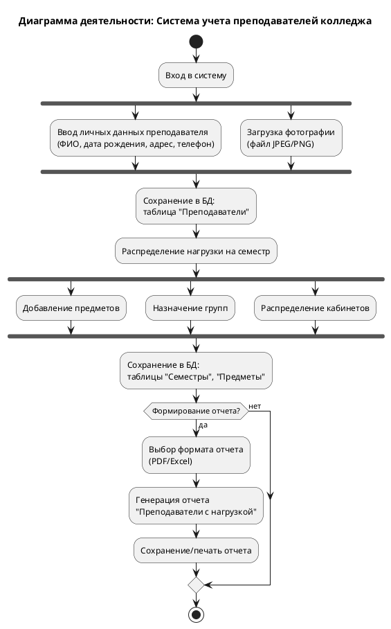
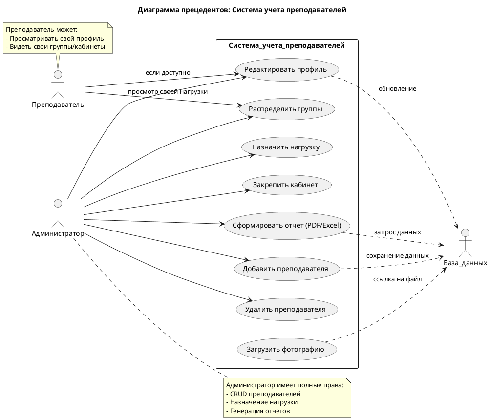
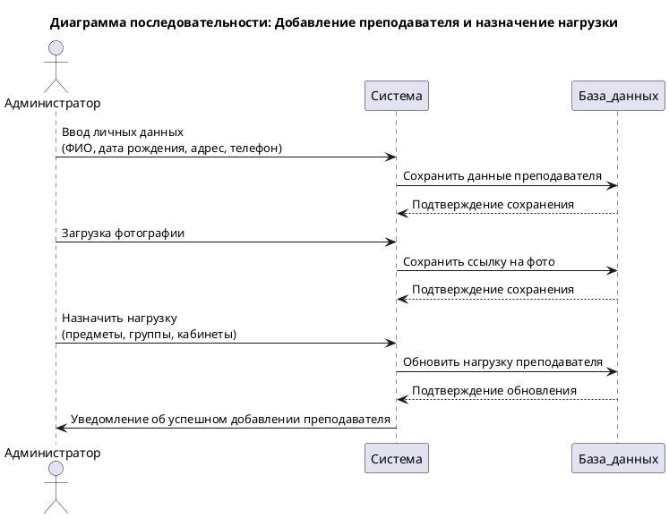
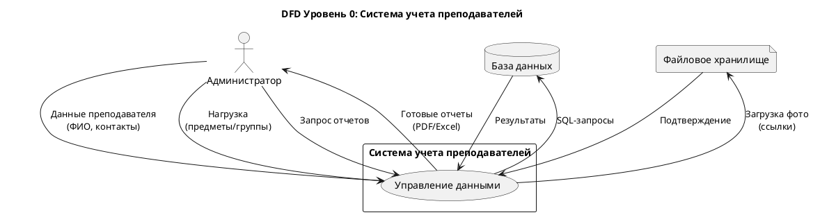
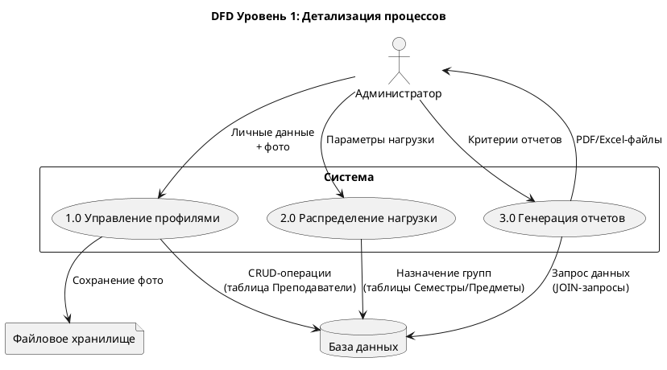
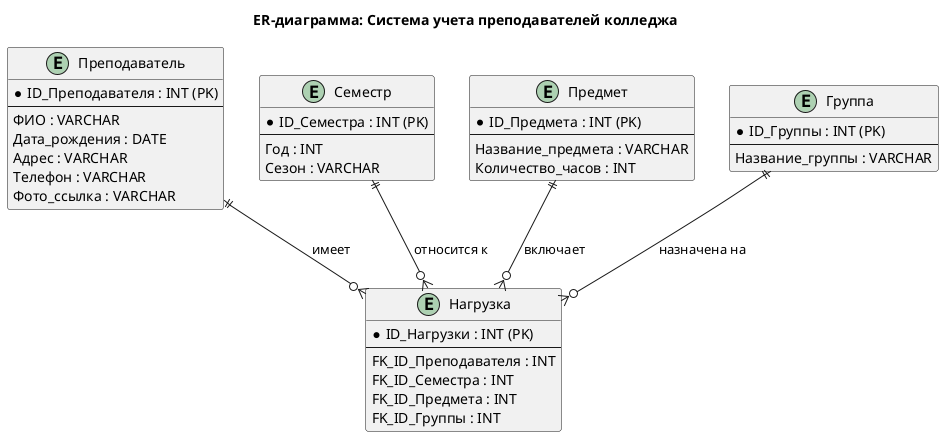

Конечно! Вот отформатированный текст для вашего README файла на GitHub. Я постарался сделать его максимально читаемым и структурированным, используя разметку Markdown.

```markdown
# Концепции и Практики Разработки Программного Обеспечения

Этот документ представляет собой обзор ключевых концепций, методологий, стандартов, принципов и инструментов, используемых в современной разработке программного обеспечения.

---

## 1. Инженерия Требований (Requirements Engineering)

Требование – это описание того, что система должна делать, какими свойствами обладать и каким ограничениям соответствовать.

### 1.1. Классификация Требований

*   **Функциональные**: Что система должна делать (например, система должна позволять пользователям регистрироваться).
*   **Нефункциональные**: Как система должна это делать (например, скорость ответа, безопасность, надежность).
*   **Бизнес-требования**: Высокоуровневые цели организации (например, цель компании «увеличить продажи на 20%»).
*   **Пользовательские требования**: Что пользователи хотят получить от системы (use-cases, например, «покупатель может оплатить заказ»).
*   **Системные требования**: Детальное описание функций системы (функциональные и нефункциональные требования, технические спецификации).

### 1.2. Уровни Требований

Иерархия требований к проекту, включающая три уровня:

1.  **Верхний (Бизнес-требования)**:
    *   Цели и задачи бизнеса, которые проект должен решить.
    *   Описывает, почему проект создан и какие бизнес-выгоды от него ожидаются.
    *   *Пример*: Цель компании «увеличить продажи на 20%».

2.  **Второй (Пользовательские требования)**:
    *   Потребности пользователя, как система должна помочь в решении задач.
    *   *Пример*: Use-case «Покупатель может оплатить заказ».

3.  **Третий (Системные требования)**:
    *   Детализированные требования, описывающие, как система должна функционировать (функциональные и нефункциональные требования).
    *   *Пример*: Иные технические спецификации.

---

## 2. Методологии и Стандарты Работы с Требованиями

### 2.1. Методологии

*   **Agile**:
    *   Итеративный подход, подчеркивающий адаптивность, непрерывную обратную связь и сотрудничество заинтересованных сторон.
    *   Требования постоянно уточняются, что позволяет командам быстро реагировать на изменения.
    *   Подходит для проектов с меняющимися или неопределенными требованиями.
*   **Waterfall (Каскадная модель)**:
    *   Линейный, последовательный подход, проходящий через отдельные фазы: сбор требований, проектирование, внедрение, тестирование и развертывание.
    *   Каждая фаза должна быть завершена перед переходом к следующей.
    *   Подходит для проектов с четко определенными требованиями с самого начала, например, в регулируемых отраслях, где обширная документация и стабильность имеют решающее значение.
*   **Гибридный подход**:
    *   Сочетает элементы Agile и Waterfall, обеспечивая гибкость для команд, которым нужна структура в одних областях и адаптивность в других.
    *   Обычно подход Waterfall применяется на ранних этапах проекта, в то время как Agile используется во время разработки, тестирования и текущих циклов обратной связи.

### 2.2. Стандарты

*   **IEEE 1362 «Concept of Operations Document»**, **IEEE 1233 «Guide for Developing System Requirements Specifications»**: Разработки IEEE, описывающие подходы к работе с требованиями.
*   **ГОСТ Р ИСО/МЭК 12207–2010**: Стандарт, регламентирующий жизненный цикл программного обеспечения, включая процессы работы с требованиями.
*   **ГОСТ Р ИСО/МЭК 15288–2005**: Стандарт, рассматривающий ключевые этапы жизненного цикла программного обеспечения, включая работу с требованиями.

---

## 3. Современные Принципы Разработки ПО

*   **Agile-манифест**: Индивидуумы и взаимодействие над процессами и инструментами.
*   **DevOps**: Интеграция разработки и эксплуатации.
*   **Микросервисная архитектура**: Разбиение системы на небольшие, независимые сервисы.
*   **CI/CD (Continuous Integration/Continuous Delivery)**: Непрерывная интеграция и доставка.
*   **Принцип KISS (Keep It Simple, Stupid)**: Делайте проще.
*   **Принцип DRY (Don't Repeat Yourself)**: Не повторяйтесь.
*   **Итерационная модель**: Позволяет вернуться на любой предыдущий этап разработки ПО для уточнения требований и исправления компонентов. Важно вовремя остановиться, итерации не могут продолжаться бесконечно.
*   **Спиральная модель**: Все этапы разработки последовательно повторяются по кругу до тех пор, пока текущая версия программы не станет полностью соответствовать требованиям.
*   **Гибкие методологии (Agile)**: Олицетворяют современные подходы к разработке ПО, обычно используются в небольших командах разработчиков (Scrum, DSDM, XP, FDD и другие).
*   **Бережливая разработка ПО (Lean)**: Цель – увеличение эффективности создания продукта и повышение результативности всех рабочих процессов. Разработка организуется таким образом, чтобы на реализацию проекта ушло меньше денег и времени.
*   **Предусмотрение возможности безболезненных изменений**: Отличает ПО от других видов промышленных продуктов, так как ПО часто разрабатывается с недостаточно определенными требованиями, которые уточняются по мере продвижения разработки.

Технология разработки программного обеспечения – комплекс мер по созданию программных продуктов.

---

## 4. Методы Организации Работы в Команде

*   **Scrum**: Итеративная разработка со спринтами.
*   **Kanban**: Визуализация рабочего процесса (workflow).
*   **Pair programming**: Два разработчика за одним компьютером.
*   **Code review**: Коллегиальная проверка кода.
*   **Ежедневные stand-up встречи**: Короткие совещания для синхронизации команды.
*   **Инструменты**: Jira, Trello, Asana.

### 4.1. Структуры Команды

*   **Равноправная основа**:
    *   Команда высококвалифицированных специалистов, разбирающихся в нескольких областях разработки.
    *   Каждый специалист отвечает за определенный участок работы.
*   **Высококвалифицированный опытный руководитель**:
    *   Команда может состоять из разработчиков, компетентных в определенных областях, но иметь высокопрофессионального руководителя, разбирающегося во всех областях.
    *   Руководитель курирует проект в целом и ставит задачи каждому члену команды.
*   **Старшие и младшие разработчики**:
    *   Команда может состоять из групп разработчиков.
    *   Более опытные (старшие) решают более сложные задачи и имеют целостное представление о проекте.
    *   Менее опытные (младшие) выполняют более простые задачи, помогая старшим, могут не иметь полного представления о проекте в целом.

---

## 5. Системы Контроля Версий (СКВ)

Программное обеспечение для облегчения работы с изменяющейся информацией. Позволяют:
*   Хранить несколько версий одного и того же документа.
*   Возвращаться к более ранним версиям.
*   Определять, кто и когда сделал то или иное изменение.

### 5.1. Особенности СКВ в Разработке ПО

*   **Отслеживание конфликтов**: Системы отслеживают конфликты при одновременном изменении одного файла разными разработчиками и предлагают средства их решения.
*   **Автоматическое объединение изменений**: Большинство систем может автоматически объединять изменения (обычно для текстовых файлов при изменении разных частей файла).
*   **Контроль прав доступа**: Системы контролируют права доступа пользователей, разрешая или запрещая чтение/изменение данных.

СКВ широко применяются при разработке программного обеспечения для хранения исходных кодов.

### 5.2. Типы СКВ

*   **Распределенные СКВ**: Наличие нескольких копий репозитория на разных серверах, где каждый разработчик имеет копию истории изменений (пример: **Git**).
*   **Централизованные СКВ**: Все версии файлов хранятся на одном сервере (пример: Subversion).
*   **Локальные СКВ**: Вся история хранится на локальном компьютере в базе данных.

### 5.3. Инструменты для Работы с СКВ

*   **IDE**: Интегрированные среды разработки с поддержкой СКВ (Visual Studio, IntelliJ IDEA).
*   **Консольные клиенты**: Программы для работы с VCS из командной строки (GitBush, Mercurial Workbench).
*   **Веб-интерфейсы**: Онлайн-сервисы в браузере, подходящие для небольших проектов (GitLab, GitHub).

---

## 6. Подходы к Интегрированию Модулей

Интеграция модулей — это объединение различных программных компонентов в единую функциональную систему, где каждый элемент выполняет свою роль, сохраняя целостность всей архитектуры.

### 6.1. Общие Подходы

*   **Big Bang**: Все модули интегрируются сразу.
*   **Incremental (Инкрементальная)**: Постепенная интеграция.
    *   **Снизу вверх**: От низкоуровневых модулей.
    *   **Сверху вниз**: От высокоуровневых модулей.
    *   **Сэндвич**: Комбинация обоих подходов.

### 6.2. Подходы к Интеграции Программных Модулей

*   **Вертикальная интеграция**:
    *   Модули объединяются в строгой иерархической последовательности (от базовых функций к высокоуровневым приложениям).
    *   *Пример*: Сбор операционных систем в единое корпоративное хранилище.
    *   *Особенности*: Постепенное тестирование, четкая структура; низкая гибкость, трудности с масштабированием.

*   **Горизонтальная интеграция**:
    *   Модули подключаются параллельно на одном уровне, что обеспечивает большую гибкость системы.
    *   *Пример*: Автоматизация управления цепями поставок.
    *   *Особенности*: Высокая гибкость, легкость масштабирования; сложность управления зависимостями.

*   **API (Application Programming Interface)**:
    *   Позволяет различным программным приложениям взаимодействовать друг с другом, обмениваться данными и функциональностью.
    *   *Принцип*: Одна система отправляет запрос, другая понимает и отвечает.
    *   *Пример*: Интеграция CRM с телефонией.

*   **События**:
    *   Компоненты взаимодействуют посредством асинхронных сообщений о событиях. Это позволяет разрабатывать, развертывать и масштабировать модули независимо друг от друга.
    *   *Принцип*: Производители событий отправляют события на шину, а потребители подписываются на определенные типы событий и выполняют действия.

*   **Непрерывная интеграция (CI)**: Автоматизированный процесс слияния изменений из разных веток разработки и их сборки/тестирования.

---

## 7. Стандарты Кодирования

Стандарты кодирования — это набор правил и соглашений, определяющих, как писать и оформлять программный код (именование, структура файлов, форматирование и т.д.).

### 7.1. Преимущества Соблюдения Стандартов Кодирования

*   **Повышение эффективности разработки**: Упрощает поддержку и обслуживание кода, сокращает время на понимание кода новыми участниками проекта.
*   **Улучшение качества кода**: Снижает количество ошибок за счет проверенных практик, облегчает код-ревью.

### 7.2. Популярные Стандарты Кодирования

*   **Python**: PEP 8.
*   **JavaScript**: Google JavaScript Style Guide, Airbnb JavaScript Guide.
*   **Java**: Google Java Style Guide.
*   **C++**: Google C++ Style Guide.

### 7.3. Собственные Стандарты Команды

Помимо общепринятых стандартов, каждая команда может создавать собственные правила программирования. Эти требования должны:
*   Не противоречить базовым стандартам языка.
*   Учитывать специфику проекта.
*   Быть задокументированы и доступны всем участникам.
*   Регулярно обновляться при необходимости.

---

## 8. Моделирование с UML (Unified Modeling Language)

UML (Unified Modeling Language) — это язык графического описания, используемый для моделирования программных систем, бизнес-процессов и других систем. Его цель — графически описать любую модель, будь то архитектура программы, структура системы или план достижения бизнес-целей.

### 8.1. Основные Термины UML

*   **Класс**: Описание множества объектов с общими атрибутами и операциями (шаблон для создания объектов).
*   **Объект**: Экземпляр класса, его версия со всеми свойствами и методами.
*   **Интерфейс**: Набор доступных операций для объекта.
*   **Компонент**: Большая часть системы (например, файл или библиотека).
*   **Узел**: Физическая или логическая единица, на которой размещаются компоненты.
*   **Взаимодействие**: Стрелка, показывающая, как один объект обращается к другому.
*   **Зависимость**: Отражает ситуацию, когда изменение одного элемента влияет на другой.
*   **Состояние**: Представляет состояние объекта в определённый момент времени.
*   **Пакет**: Группирует несколько элементов диаграммы по определенному критерию.
*   **Заметка**: Добавляет комментарий или дополнительную информацию к другим элементам.

### 8.2. Примеры Использования UML

*   **Разработка ПО**: Диаграммы классов помогают определить объекты (Пользователь, Товар, Заказ) и их свойства/методы.
*   **Бизнес-анализ**: Визуализация рабочих процессов, выявление узких мест.
*   **Проектирование БД**: Формализация структуры таблиц и связей.
*   **Системная инженерия**: Моделирование взаимодействия программных и аппаратных компонентов.

### 8.3. Что Показывают Диаграммы UML

Диаграммы UML — это наглядные схемы, описывающие структуру, поведение и взаимодействие компонентов системы. UML не является языком программирования, это язык визуализации.

*   **Кто взаимодействует с системой**: Пользователи, внешние сервисы (Диаграммы прецедентов).
*   **Какие объекты есть в системе и как они связаны**: Классы, компоненты, модули (Диаграммы классов, компонентов).
*   **Как протекают процессы и логика**: Шаги, ветвления, условия (Диаграммы активности, состояний).
*   **Как объекты обмениваются сообщениями**: Последовательность вызовов, порядок действий (Диаграммы последовательности).

---

## 9. Спецификация и Анализ Требований

### 9.1. Описание и Оформление Требований (Спецификация)

**Спецификация требований программного обеспечения (SRS - Software Requirements Specification)** — структурированный набор требований к ПО и его внешним интерфейсам.

**Структура SRS**:
*   Введение
*   Общее описание
*   Функциональные требования
*   Нефункциональные требования
*   Интерфейсы
*   Ограничения

**Язык спецификации**: Четкий, однозначный, измеримый.

### 9.2. Анализ Требований и Стратегии Выбора Решения

**Анализ требований** — процесс выявления, определения и документирования требований к системе, продукту или процессу. Стратегии выбора решения помогают оценить альтернативы, учесть риски и выбрать оптимальный вариант.

#### Процесс Анализа Требований

1.  **Сбор информации**: Сбор данных о проекте, целях, существующих решениях.
2.  **Анализ**: Выявление требований, определение функций, запросов к интерфейсу и производительности.
3.  **Документирование**: Запись требований и создание документации.
4.  **Проверка выводов**: Соответствие требованиям, выявление и устранение противоречий.
5.  **Внесение изменений**: Корректировка требований по ходу проекта.

#### Методы Анализа Требований

*   **Интервью с заинтересованными сторонами**: Выяснение ожиданий и потребностей пользователей.
*   **Анкетирование**: Сбор информации от большого числа пользователей.
*   **Наблюдение за пользователями**: Понимание взаимодействия с текущими системами, выявление скрытых требований.
*   **Анализ документов**: Изучение существующих бизнес-процессов, спецификаций, отчетов.
*   **Моделирование**: Визуализация требований и их взаимосвязей (например, с помощью UML).

#### Стратегии Выбора Решения

*   **Рациональная стратегия**: Логический и систематический подход, сбор и анализ информации, оценка альтернатив.
*   **Интуитивная стратегия**: Основана на внутреннем чувстве и опыте, часто используется в условиях неопределенности.
*   **Комбинированная стратегия**: Объединяет рациональный и интуитивный подходы.
*   **Метод «дерево решений»**: Визуализация возможных вариантов и их последствий.
*   **Метод «мозгового штурма»**: Коллективная генерация идей.

**Примеры Применения**:
*   **Разработка ПО**: Определение потребностей пользователей и перевод их в конкретные требования.
*   **Принятие управленческих решений**: Сравнение альтернатив, оценка рисков.

---

## 10. Тестирование и Обеспечение Качества ПО

### 10.1. Цели и Задачи Тестирования

*   **Цели**:
    *   Проверка соответствия ПО предъявляемым требованиям.
    *   Обеспечение уверенности в качестве ПО.
    *   Поиск ошибок до того, как их обнаружат пользователи.
    *   Повышение вероятности корректной работы приложения в любых обстоятельствах.
    *   Проведение полного тестирования приложения за короткий срок.
*   **Задачи**:
    *   Проверка времен отклика клиента и сервера.
    *   Проверка корректности выполнения критических последовательностей действий пользователя.
    *   Проверка работы пользовательских интерфейсов.
    *   Проверка влияния изменений в БД на существующие модули.

### 10.2. Виды Тестирования

*   **Функциональное**: Проверка корректности работы функциональности.
*   **Нефункциональное**: Тестирование атрибутов, не относящихся к функциональности (производительность, безопасность и т.д.).
*   **Тестирование производительности**: Определение стабильности и потребления ресурсов.
*   **Нагрузочное**: Оценка устойчивости к нагрузке большого количества данных.
*   **Тестирование масштабируемости**: Измерение производительности при изменении числа пользователей.
*   **Объёмное тестирование**: Тестирование с определенным объемом данных.
*   **Стрессовое тестирование**: Проверка поведения системы при нарастающей нагрузке.
*   **Инсталляционное**: Проверка успешной установки, настройки, обновления или удаления приложения.
*   **Тестирование интерфейса**: Проверка требований к пользовательскому интерфейсу.
*   **Тестирование удобства использования (Usability)**: Оценка удобства, понятности и привлекательности для пользователей.
*   **Тестирование локализации**: Проверка адаптации ПО для определенной аудитории с учетом культурных особенностей.
*   **Тестирование безопасности**: Проверка безопасности системы, анализ рисков, защита от атак и несанкционированного доступа.

### 10.3. Стандарты Качества Программной Документации

**Критерии качества документации**:
*   **Полнота**: Охват всех аспектов работы ПО.
*   **Точность**: Достоверность и актуальность информации.
*   **Понятность**: Ясность и структурированность текста.
*   **Непротиворечивость**: Отсутствие конфликтующих данных.
*   **Актуальность**: Обновление вместе с ПО.

**Международные стандарты**:
*   **ISO/IEC/IEEE 26515**: Пользовательская документация.
*   **ISO/IEC 12207**: Документация на всех этапах жизненного цикла ПО.
*   **IEEE 830**: Структура спецификации требований (SRS).

**Российские стандарты (ГОСТ)**:
*   **ГОСТ 34.201-89**: Виды и комплектность документов для автоматизированных систем (АС).
*   **ГОСТ Р 56939-2016**: Документация для критических систем.
*   **ЕСПД**: Комплекс государственных стандартов, устанавливающих правила разработки и оформления программ и документации.

### 10.4. Меры и Метрики

*   **Мера**: Количественный показатель степени, количества или размеров некоторых атрибутов продукта или процесса.
*   **Метрика**: Количественная мера, позволяющая оценить, в какой степени система, компоненты или процесс обладают заданным атрибутом.

**Типы мер**: Размер, время, усилия, учет (количество ошибок, отказов). Меры часто субъективны.

**Метрики**: Служат основой для объективной оценки.

*   **Метрики кода**:
    *   **Цикломатическая сложность**: Количество независимых путей выполнения в коде.
    *   **Количество строк кода (SLOC)**: Базовый показатель объёма.
    *   **Глубина наследования**: Характеристика иерархии классов.
*   **Метрики процесса разработки**:
    *   **Скорость выполнения задач (Velocity)**: Количество завершенных пользовательских историй за спринт.
    *   **Время устранения дефектов**: Эффективность тестирования и отладки.
    *   **Коэффициент повторного использования кода**: Активность применения существующих модулей.
*   **Метрики качества ПО**:
    *   **Плотность дефектов**: Количество ошибок на тысячу строк кода.
    *   **Индекс удовлетворенности пользователей (CSI)**: Обратная связь от клиентов.

### 10.5. Тестовое Покрытие

Метрика оценки качества тестирования, представляющая собой плотность покрытия тестами требований или исполняемого кода.

*   **Виды тестового покрытия**:
    *   **Покрытие строк кода (Line Coverage)**: Процент выполненных тестами строк кода.
    *   **Покрытие ветвей (Branch Coverage)**: Процент выполненных тестами ветвей кода (if, else, switch).
    *   **Покрытие функций (Function Coverage)**: Процент выполненных тестами функций и методов.

*   **Роль тестового покрытия**:
    *   Помогает обнаружить непротестированные участки кода.
    *   Оценивает качество тестирования.
    *   Мотивирует разработчиков писать тесты.

### 10.6. Тестовый Сценарий

Документ, описывающий последовательность действий для проверки аспекта ПО.

*   **Структура тестового сценария**:
    *   **Название**: Краткое описание тестируемого процесса.
    *   **Описание**: Что именно тестируется и в каком контексте.
    *   **Предусловия**: Условия, которые должны быть выполнены перед тестом.
    *   **Шаги**: Основные действия.
    *   **Ожидаемый результат**: Критерий успешного выполнения.

*   **Типы тестовых сценариев**:
    *   **Функциональные**: Проверяют функциональность ПО.
    *   **Нефункциональные**: Проверяют производительность, безопасность и т.д.
    *   **Интеграционные**: Проверяют взаимодействие между компонентами.
    *   **Системные**: Проверяют ПО как единое целое.
    *   **Для приёма в эксплуатацию**: Выполняются перед выпуском ПО.

*   **Как писать тестовый сценарий**:
    *   Собрать требования, изучить документацию.
    *   Определить цель тестирования.
    *   Описать шаги ясно и полно.
    *   Прописать ожидаемые результаты для каждого шага.
    *   Оформить документацию в соответствии со стандартами.

*   **Примеры тестовых сценариев**:
    *   *Проверка регистрации пользователя*: Открыть страницу, ввести данные, нажать кнопку. Ожидаемый результат: сообщение об успехе.
    *   *Проверка добавления товара в корзину*: Открыть страницу товара, нажать кнопку. Ожидаемый результат: товар добавлен в корзину.
    *   *Проверка отправки письма*: Войти в почту, написать письмо, нажать "Отправить". Ожидаемый результат: письмо отправлено.

### 10.7. Тестовый Пакет

Набор тестовых случаев, скриптов и других артефактов, используемых для проверки ПО.

*   **Структура тестового пакета**:
    *   Планы тестирования.
    *   Тестовые случаи.
    *   Тестовые сценарии.
    *   Тестовые данные.
    *   Тестовые среды.

*   **Типы тестовых пакетов**:
    *   **Функциональные**: Проверяют функциональность с точки зрения бизнес-логики.
    *   **Интеграционные**: Проверяют взаимодействие между компонентами.
    *   **End-to-End (E2E)**: Проверяют всю систему целиком.
    *   **Производительные**: Измеряют производительность системы.

*   **Процесс создания тестового пакета**:
    *   Определение области тестирования.
    *   Разработка тестовых случаев.
    *   Подготовка тестовых данных.
    *   Настройка тестового окружения.
    *   Выполнение тестов.
    *   Анализ результатов.
    *   Документирование.
    *   Улучшение и исправление.

### 10.8. Верификация и Аттестация ПО

*   **Верификация**: Проверка соответствия ПО требованиям на всех этапах разработки («правильно ли делаем?»).
*   **Аттестация (Валидация)**: Проверка, удовлетворяет ли готовый продукт потребностям пользователя («правильное ли сделали?»).
*   **Методы**: Тестирование, инспекции, доказательство корректности.

---

## 11. Жизненный Цикл ПО (ЖЦ ПО)

Этапы, через которые проходит ПО с начала создания до внедрения.

### 11.1. Этапы ЖЦ ПО

1.  **Планирование**: Определение целей, сроков, ресурсов и задач проекта.
2.  **Анализ требований**:
    *   Цель: Определить, что должно делать ПО.
    *   Действия: Сбор требований, анализ бизнес-процессов, формирование ТЗ.
3.  **Проектирование**:
    *   Цель: Определить, как будет работать система.
    *   Действия: Выбор архитектуры, проектирование БД, API, интерфейсов, создание прототипов (UML, ER-диаграммы).
4.  **Разработка**:
    *   Цель: Написание кода по утвержденному дизайну.
    *   Действия: Программирование, модульное тестирование (Unit Testing), интеграция компонентов.
5.  **Тестирование**:
    *   Цель: Выявление и исправление ошибок.
    *   Действия: Функциональное, нагрузочное, безопасность, юзабилити тестирование, регрессионные проверки.
6.  **Внедрение**: Запуск системы для пользователей, настройка ПО, обучение персонала.
7.  **Сопровождение и поддержка**:
    *   Цель: Улучшение и исправление после релиза.
    *   Действия: Исправление багов, обновления, оптимизация производительности.

### 11.2. Модели Жизненного Цикла

*   **Каскадная (Waterfall)**: Строгая последовательность этапов.
*   **Гибкая (Agile/Scrum)**: Итеративная разработка.
*   **V-образная**: Тестирование на каждом этапе.
*   **Спиральная**: Циклическая разработка с оценкой рисков.

---

## 12. Разработка Пользовательских Интерфейсов (UI)

### 12.1. Типы Интерфейсов

*   **Графический (GUI)**
*   **Командной строки (CLI)**
*   **Веб-интерфейсы**
*   **Голосовые**

### 12.2. Этапы Разработки UI

*   Анализ пользователей.
*   Прототипирование.
*   Тестирование удобства использования (Usability Testing).
*   Реализация.

---

## 13. Техническое Задание (ТЗ)

ТЗ – документ, определяющий, как система должна быть создана и модернизирована. В нем прописываются требования к системе.

### 13.1. Общие Сведения

*   Наименование системы.
*   Название предприятий.
*   Сроки, стоимость.

### 13.2. Назначение и Цели Создания

*   **Назначение системы**: Для какой деятельности будет применяться продукт.
*   **Цели создания**: Целевые показатели и критерии их выполнения.
*   **Характеристика объектов автоматизации**: Сведения об объекте автоматизации и условиях эксплуатации.

### 13.3. Требования к Системе

*   Требования к системе в целом.
*   Требования к функциям системы.
*   Требования к видам обеспечения.

### 13.4. Состав и Содержание Работ по Созданию Системы

Этапы и стадии для создания системы, сроки и ответственные.

### 13.5. Порядок Контроля и Приемки Системы

Виды, методы, объем испытаний системы.

### 13.6. Требования к Подготовке Объекта Автоматизации к Вводу Системы в Действие

Перечень мероприятий для запуска системы.

### 13.7. Требования к Документированию

### 13.8. Источники Разработки

---

## 14. Оценка Качества ПО

### 14.1. Методы Оценки

*   Экспертный анализ.
*   Тестирование.
*   Метрики (сложность кода, покрытие тестами).

---

## 15. Внедрение Программного Комплекса

Цель: Обеспечить корректную установку и настройку ПО в рабочей среде.

### 15.1. Этапы Внедрения

1.  **Планирование внедрения**: Определение сроков, стратегии развертывания, подготовка инфраструктуры.
2.  **Развертывание (Deployment)**: Установка ПО на серверы/рабочие станции.
3.  **Интеграция с другими системами**: Проверка взаимодействия с внешними сервисами (API, CRM, ERP).
4.  **Обучение пользователей**: Инструктажи, подготовка документации.

### 15.2. Подготовка Тестовых Данных

*   **Принципы формирования**:
    *   **Репрезентативность**: Данные должны отражать реальные сценарии использования.
    *   **Полнота**: Покрытие всех возможных вариантов входных параметров.
    *   **Безопасность**: Исключение конфиденциальной информации.
*   **Типы тестовых данных**:
    *   Нормальные данные (корректные).
    *   Граничные значения.
    *   Некорректные данные.
    *   Деструктивные данные.
*   **Методы генерации**:
    *   Ручное создание.
    *   Автоматизированная генерация (скрипты, инструменты).
    *   Копирование и обезличивание производственных данных.

### 15.3. Анализ Результатов Испытаний

*   **Цель**: Оценить соответствие ПО требованиям, выявить ошибки.
*   **Сравнение с ожидаемыми результатами**: Проверка по тест-кейсам.
*   **Классификация ошибок**: Критические/некритические, функциональные/интерфейсные/производительности.
*   **Формирование отчетов**: Документирование дефектов (баг-репорты), рекомендации по доработке.
*   **Оценка готовности к внедрению**.

---

## 16. Управление Разработкой и Проектами

### 16.1. Управление Разработкой ПО

Процесс планирования, организации и контроля всех этапов создания ПО для достижения целей проекта (сроки, бюджет, качество).

*   **Ключевые задачи**:
    *   Планирование (сроки, ресурсы, этапы).
    *   Организация (распределение ролей).
    *   Контроль (прогресс, риски, изменения).
    *   Документирование.
    *   Координация команд.
    *   Риск-менеджмент.

*   **Основная цель управления жизненным циклом ПО**: Обеспечить эффективное создание качественного продукта в рамках установленных сроков, бюджета и требований.

### 16.2. Средства Управления Проектами

*   **Планирование и отслеживание задач**:
    *   Jira (задачи, спринты, отчеты).
    *   Trello (канбан-доски).
    *   Microsoft Project (диаграммы Ганта).
*   **Контроль версий кода**: GitHub/GitLab.
*   **Коммуникация**: Slack, Confluence (документация).
*   **Автоматизация сборки и тестирования**: Jenkins.

---

## 17. Инструментальные Средства Разработки

*   **Среды программирования**: Visual Studio, Eclipse.
*   **CASE-средства**: Rational Rose, Enterprise Architect.
*   **Интегрированные среды (IDE)**: PyCharm, IntelliJ IDEA.

---

## 18. Парадигмы Программирования

### 18.1. Структурное Программирование

*   **Принципы**: Разделение на подзадачи (декомпозиция), использование базовых управляющих структур (последовательность, ветвление, цикл), отказ от `goto`.
*   **Мнемоника**: «Структурное = Линейка + Ветки + Кружочки».
*   **Структуры**: Следование, Ветвление (if-else, switch), Циклы (for, while).
*   **Достоинства**: Чёткая логика, простота отладки, повторное использование кода, лёгкость модификации.
*   **Цели**: Упрощение разработки и поддержки, повышение надежности, уменьшение ошибок, облегчение коллективной работы.

```python
# Пример структурного программирования
# Модуль calculations.py
def calculate_salary(hours, rate):
    return hours * rate

# Модуль tax.py
def apply_tax(salary):
    return salary * 0.9

# Основной файл main.py
from calculations import calculate_salary
from tax import apply_tax

salary = calculate_salary(40, 15)
final_salary = apply_tax(salary)
```

### 18.2. Модульное Программирование

*   **Определение**: Подход, при котором программа разбивается на независимые, функционально завершенные блоки (модули), взаимодействующие через четко определенные интерфейсы.
*   **Мнемоника**: «Модуль = Черный ящик с входом и выходом».
*   **Цели**: Упрощение разработки, повышение надежности, повторное использование кода, улучшение читаемости и поддержки, облегчение командной работы.
*   **Достоинства**: Гибкость, масштабируемость, тестируемость, уменьшение дублирования кода, упрощение отладки.

```python
# Пример модульного программирования (аналогичен структурному)
# Модуль calculations.py
def calculate_salary(hours, rate):
    return hours * rate

# Модуль tax.py
def apply_tax(salary):
    return salary * 0.9

# Основной файл main.py
from calculations import calculate_salary
from tax import apply_tax

salary = calculate_salary(40, 15)
final_salary = apply_tax(salary)
```

### 18.3. Объектно-Ориентированное Программирование (ООП)

*   **Парадигма**: Программа – это набор взаимодействующих объектов, каждый из которых является экземпляром класса.
*   **Основные понятия**:
    *   **Объект**: Экземпляр класса (имеет свойства и методы).
    *   **Свойство (атрибут)**: Данные, описывающие объект (цвет, скорость).
    *   **Метод**: Функция, которую может выполнять объект (ехать(), тормозить()).
    *   **Событие**: Действие, на которое объект может реагировать (клик, наведение).
    *   **Класс**: Шаблон для создания объектов.
*   **Методы ООП-декомпозиции**: Разбиение системы на объекты, инкапсуляция данных и методов, взаимодействие через сообщения (вызов методов).
*   **Преимущества ООП**: Инкапсуляция, Наследование, Полиморфизм.

```python
# Пример ООП
class Car:
    def __init__(self, color, speed):
        self.color = color  # Атрибут
        self.speed = speed

    def drive(self):  # Метод
        print(f"Машина едет со скоростью {self.speed} км/ч")

my_car = Car("синий", 90)  # Объект
my_car.drive()
```

#### Сравнение Парадигм

| Критерий        | Структурное       | Модульное       | ООП                |
| :-------------- | :---------------- | :-------------- | :----------------- |
| Организация     | Линейный код      | Файлы-модули    | Классы и объекты   |
| Масштабируемость| Низкая            | Средняя         | Высокая            |
| Подходит для    | Простые скрипты  | Средние проекты | Сложные системы    |

---

## 19. Надежность ПО

Работоспособность — способность выполнять функции в заданных условиях.

*   **Показатели надежности**: Вероятность безотказной работы, среднее время наработки на отказ (MTBF), частота отказов.
*   **Тестирование vs Отладка**:
    *   **Тестирование**: Проверка соответствия ПО требованиям, выявление ошибок.
    *   **Отладка**: Локализация и исправление ошибок.
*   **Объекты тестирования**: Исходный код, модули, компоненты, интерфейсы, БД, интеграционные взаимодействия, система в целом.
*   **Особенности тестирования**: Планируемый процесс, использование разных уровней (unit, integration, system), ручные/автоматизированные методы, документирование результатов.
*   **Автономное тестирование**: Проверка отдельных компонентов изолированно (ранние этапы, быстрая локализация ошибок).
*   **Комплексное тестирование**: Проверка взаимодействия компонентов/систем (поздние этапы, выявление интеграционных проблем).

---

## 20. Примеры Диаграмм UML для Системы Учета Преподавателей Колледжа

### 20.1. Предметная Область

**Система учета преподавателей колледжа**

*   **Входные данные**:
    *   Личные данные преподавателя (ФИО, дата рождения, адрес, телефон).
    *   Сведения о семестре: предметы, группы, кабинеты.
    *   Фотография (файл в формате JPEG/PNG).
*   **Функционал**:
    *   **Добавление/редактирование профиля**: Внесение анкетных данных, загрузка фото.
    *   **Управление нагрузкой**: Распределение групп и кабинетов на семестр.
    *   **Отчеты**: Формирование списка преподавателей с их нагрузкой (PDF/Excel).
*   **Как работает**:
    *   Данные хранятся в SQL-БД (таблицы: Преподаватели, Семестры, Предметы).
    *   Для загрузки фото используется хранение ссылок на файлы.
    *   Фильтрация по группам/предметам через SQL-запросы.
*   **Пример использования**: Добавить преподавателя Иванова А.С., назначить на семестр математику в группы П-21, каб. 305. Сформировать отчет "Преподаватели весеннего семестра 2024".

### 20.2. Диаграмма Деятельности (Activity Diagram)

Описывает последовательность действий и поток управления в процессе.



### 20.3. Функциональная Схема (Functional Scheme Diagram)

Графическое представление системы в виде блоков, отображающих компоненты и их взаимодействие. Акцент на структурных элементах и связях.


### 20.4. Диаграмма Прецедентов (Use Case Diagram)

Показывает акторов, прецеденты (функции) и связи между ними.



### 20.5. Диаграмма Последовательности (Sequence Diagram)

Показывает, как объекты взаимодействуют друг с другом в определенном сценарии и порядок вызовов.



### 20.6. Диаграмма Потоков Данных (DFD)

Визуализирует процессы обработки данных, хранилища данных и потоки между ними.

**0 Уровень (Контекстная DFD)**:



**1 Уровень (Детализация процессов)**:



### 20.7. ER-Диаграмма (Entity-Relationship Diagram) в 3-НФ

Графическое представление сущностей, их атрибутов и взаимосвязей между ними, организованное по правилам нормализации.



---
```
